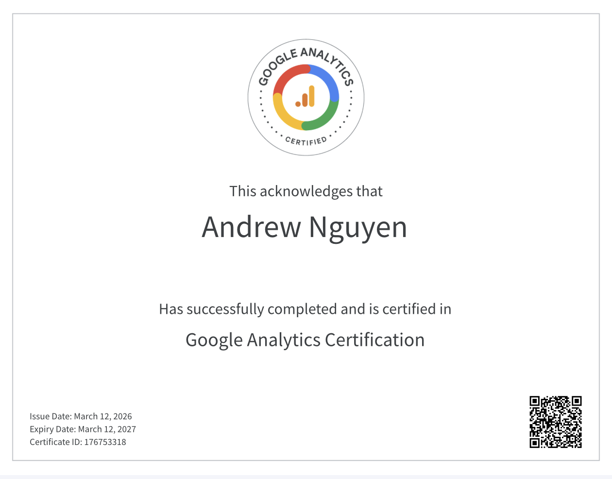
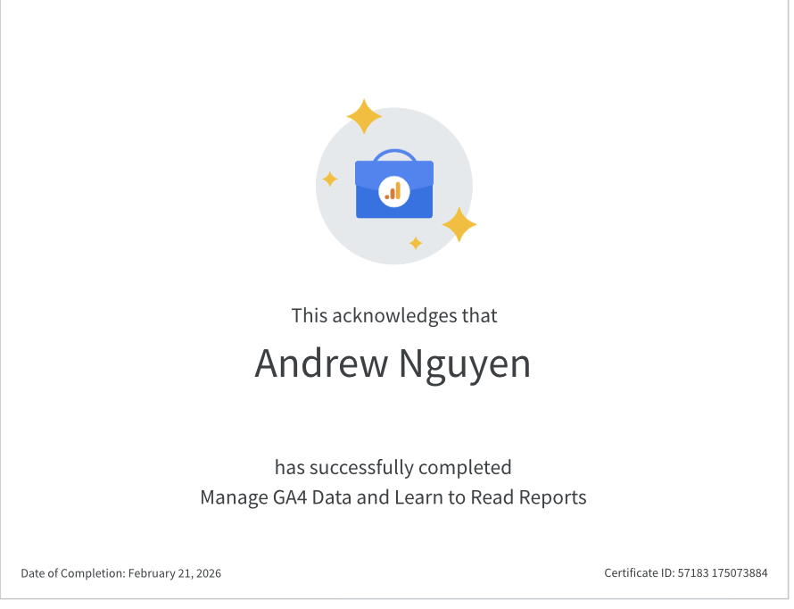

# Marketing Projects

## Google Analytics Certification

I earned the Google Analytics Certification through Google Skillshop, demonstrating my ability to analyze website data and generate insights.

[View Credential](https://skillshop.credential.net/bcfce246-1314-4132-84c1-b90e58e1fc50#acc.cdzQmN0y)

## GA4 Analysis Project

I completed a Google Analytics 4 project where I analyzed website traffic and user behavior to uncover key insights. I examined metrics such as traffic sources, engagement rates, and user activity to evaluate performance and identify areas for improvement. This project strengthened my ability to use data to support marketing strategies and make informed decisions.

[View GA4 Analysis](https://skillshop.credential.net/4b232168-5f3b-43ab-ab53-dd8e49487847#acc.iFvgrSbc)
